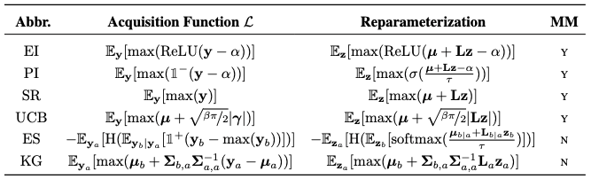

# Outline
1. Monte Carlo 獲得関数
2. 勾配法による最大化
3. 貪欲法による逐次最適化（Sequentialモード）

# Intro

[前回](https://qiita.com/narrowlyapplicable/items/d8e9be53f73d6fa5e4d3)に引き続き、[BoTorch](https://botorch.org/)の解説記事です。

BoTorchの最大の特徴は、獲得関数の最大化を勾配法で統一している点にあります。  
ベイズ最適化（Bayesian Optimization; BO）では通常、候補点の中から獲得関数を最大にする点を選び、次の評価対象とします。
$$x^{*} = \argmax_{\mathbb{x}}{\mathcal{L}(\mathbb{x})}$$
しかしこの最大化は必ずしも容易ではなく、複雑な獲得関数（Entropy SearchやKnowledge Gradientなど）を扱う場合や、複数の候補点を選ぶ（Parallel Selection）場合などにおいては、一般に勾配法による最適化は実行困難となります。この最大化自体がBlack-Box最適化問題となり、CMA-ESなど別のBlack-Box最適化手法に頼ることになります。  

BoTorchはこうした煩雑な処理を避け、獲得関数最大化を通常の勾配法に統一しています。これにより、GpyOptなどの先行ライブラリに比べて、多彩な獲得関数の使用やParallel Selectionの気軽な実行が可能となっています。  
これを可能にしているのが、Monte Carlo獲得関数（以下、「MC獲得関数」）です。本記事では、このMC獲得関数の解説を目的とします。  

前回同様、ガウス過程やベイズ最適化の基礎は説明しません。他の資料を参照してください。

# 1. Monte Carlo獲得関数
## 1.1. 元論文
BoTorchのドキュメントにはMC獲得関数およびその最大化に関する参考文献がいくつか示されていますが、主要なものは下記の2つです。

- 元論文１：[The Reparameterization Trick for Acquisition Functions](https://arxiv.org/abs/1712.00424)
- 元論文２：[Maximizing acquisition functions for Bayesian optimization](https://proceedings.neurips.cc/paper/2018/hash/498f2c21688f6451d9f5fd09d53edda7-Abstract.html)

元論文１でMC獲得関数が初めて提案されています。この時点で獲得関数の最大化が目的に挙げられていますが、元論文２で獲得関数最大化自体が扱われています。

これ以前にも、EI（Expected Improvement）やKG（Knowledge Gradient）などの特定の獲得関数において、Parallel Selectionを可能とする改良案（qEI, qKG）は提案されていました。

- 先行論文１：[A Multi-points Criterion for Deterministic Parallel Global Optimization based on Gaussian Processes](https://hal.archives-ouvertes.fr/hal-00260579)
- 先行論文２：[The Parallel Knowledge Gradient Method for Batch Bayesian Optimization](https://arxiv.org/abs/1606.04414)
- 先行論文３：[Parallel Bayesian Global Optimization of Expensive Functions](https://arxiv.org/abs/1602.05149)

しかし上記の元論文×２で提案されたMC獲得関数は、より広範な（よく知られたもののうち大半の）獲得関数に対して一貫した手法を提供しました。BoTorchはこのMC獲得関数を核とし、多彩な獲得関数を扱いやすい形で提供しています。
~~先行論文はあまりちゃんと読めてないです…~~

## 1.2. 定義
### 1.2.1. 必要な表記と諸概念
問題設定

- 観測済みのデータ $\mathcal{D} := \{ (\mathbb{x}_i, y_i) \}_{i=1}^N, \mathbb{x}_i\in\mathbb{R}^{d}$ から、最適なq個の候補点 $\mathbf{X}\in\mathbb{R}^{q\times d}$ を決定したい。
- 代理モデル（surrogate model）としてガウス過程（GP） $p(f|\mathcal{D})$ を使い、そのハイパーパラメータをデータに適合させた結果を $\mathcal{M}(\mathbf{X}):=(\mu(\mathbf{X}), \mathbf{\Sigma}(\mathbf{X}))$ と書く。$\mathbf{X}$の下での事後分布は $\mathcal{N}(\mathbf{y}|\mathbf{\mu}, \mathbf{\Sigma})$。

utility関数

- 大半の獲得関数は、何らかの関数（utility関数）$l$の期待値として表すことができます。
  - 獲得関数 $\mathcal{L}(\mathbf{X})$ のutility関数を $l(\mathbf{y})$ とすると、$$\mathcal{L}(\mathbf{X}) = \mathbb{E}_{\mathbf{y}}[l(\mathbf{y})] = \int{l(\mathbf{y})p(\mathbf{y}|\mathbf{X}, \mathcal{D})d\mathbf{y}}$$ と書き換えます。
  - 獲得関数がパラメータ$\alpha$を持つ場合、utilityもそれに対応し $\mathcal{L}(\mathbf{X};\alpha) = \mathbb{E}_{\mathbf{y}}[l(\mathbf{y};\alpha)]$ となります。
  - 代表的な獲得関数に対するutilityの一覧は、元論文２の表に示されています。 
    出典：[Maximizing acquisition functions for Bayesian optimization](https://proceedings.neurips.cc/paper/2018/hash/498f2c21688f6451d9f5fd09d53edda7-Abstract.html)

### 1.2.2. Monte Carlo近似
ガウス過程の事後分布 $p(\mathbf{y}|\mathbf{X}, \mathcal{D})$ はパラメータ既知の正規分布なので、サンプル$\mathbf{y}^k\sim p(\mathbf{y}|\mathbf{X}, \mathcal{D})$を生成してMonte Carlo近似できます。
$$\mathcal{L}(\mathbf{X}) \approx \mathcal{L}_m(\mathbf{X}) := \frac{1}{m}\sum_{k=1}^m{l(\mathbf{y^k})}$$

勾配法で最適な入力$\mathbf{X}$を決めるには、獲得関数の勾配が必要です。
上記の近似から獲得関数の勾配を求めるには、微分と期待値（積分）の交換 $$\nabla\mathcal{L} = \nabla\mathbb{E}[l(\mathbf{y})]=\mathbb{E}[\nabla l(\mathbf{y})]$$ が成り立つ必要があります。

- 交換 $\nabla\mathbb{E}[l(\mathbf{y})]=\mathbb{E}[\nabla l(\mathbf{y})]$ の成立条件
  - 被積分関数 $l$ が連続
  - $l^{\prime}$ がほとんど至る所で（そうでない点の測度が0で）存在し、積分可能

この条件はGPのカーネル関数に依存しますが、[2回微分可能なカーネルを使用すれば成立することが示されており](https://arxiv.org/abs/1602.05149)、通常用いるMaternカーネルなどでは問題になりません。
（リンク先の論文の§4.1.で交換可能性が検討されています。）

上記の交換が成り立てば、獲得関数の勾配もMonte Carlo近似できます。

$$\nabla\mathcal{L}(\mathbf{X}) \approx \nabla\mathcal{L}_m(\mathbf{X}):= \frac{1}{m}\sum_{k=1}^m{\nabla l(\mathbf{y^k})}$$

以上より、*勾配を計算できる獲得関数の近似* $\mathcal{L}_m(\mathbf{X})$ が得られました。これが**Monte Carlo獲得関数**です。

## 1.3. BoTorch実装（EIの場合）
EIを例に、BoTorchでの実装を確認しておきます。EIのMC獲得関数版（qEI）は[`qExperimentImprovement`](https://github.com/pytorch/botorch/blob/v0.6.0/botorch/acquisition/monte_carlo.py#L93)として実装されています。このうち実際の計算を担うのは`forward()`メソッドです。

```py:monte_carlo.py
    @concatenate_pending_points
    @t_batch_mode_transform()
    def forward(self, X: Tensor) -> Tensor:
        ### (中略)
        posterior = self.model.posterior(X)
        samples = self.sampler(posterior)
        obj = self.objective(samples, X=X)
        obj = (obj - self.best_f.unsqueeze(-1).to(obj)).clamp_min(0)
        q_ei = obj.max(dim=-1)[0].mean(dim=0)
        return q_ei
```

- 冒頭のデコレータ×２は最適化の際に使用するもので、獲得関数の計算自体には影響しません。
  - 最初の`concatenate_pending_points`デコレータは、Sequentialモード（後述）で候補点を逐次的に決めていく際、決定済みの候補点を入力に追加する（しかし最適化対象からは外す）ために使用するものです。
  - 2番目の`t_batch_mode_transform()`は、初期値を変えて複数回の最適化を独立に実行する（t-batch動作）のため、入力データを変換するデコレータです。

- `forward(X)`において、指定した入力点（複数可）`X`に対するqEIを計算します。

  ```py:example
  gp = SingleTaskGP(train_X, train_Y)
  ### (中略)：gpのハイパーパラメータは調整済とする
  best_f = train_Y.max() # 既存点の最大値を求めてqEIに与える 
  qEI = qExpectedImprovement(gp, best_f)
  ```

  1. `X`における事後分布 $p(\mathbf{y}|\mathbf{X})$ から、準モンテカルロ法によるサンプリング
     - `posterior = self.model.posterior(X)`で、与えたGPモデル`gp`の事後分布を取得し、`samples = self.sampler(posterior)`によりサンプリング実行
     - `self.sampler`は何も指定しなければ`SobolQMCNormalSampler`で512個のサンプルを生成
  2. 取得サンプル$\{\mathbf{y}^k\}$ を、指定した`objective`で変形
     - デフォルトでは`squeeze(-1)`するだけの`IdentityMCObjective`
     - 出力が多変数の場合、出力に重み付けするために使用する？
  3. qEIのutilityを計算
     - $ReLU(\mathbf{y} - \alpha)$ を計算
       - `obj = (obj - self.best_f.unsqueeze(-1).to(obj)).clamp_min(0)`
     - 候補点$\mathbf{X}$に関する最大値 $\max(ReLU(\mathbf{y} - \alpha))$ を取る
       - `obj.max(dim=-1)[0]`
     - サンプル平均 = 期待値のMC近似を求め $\mathcal{L}_m(\mathbf{X}) = \mathbb{E}_{\mathbf{y}}[\max(ReLU(\mathbf{y} - \alpha))]$ を得る

## 1.4. 非連続性への対応
PI（改善確率）やES（エントロピー探索）系の獲得関数を用いる場合、utilityにHeaviside関数が現れ、被積分関数の非連続性が生じます。

# 2. 勾配法による最適化
## 2.1. re-parametrizationによる勾配評価
MC獲得関数の勾配

```math
\nabla{l(\mathbf{y})}=\frac{\partial l(\mathbf{y})}{\partial{\mathbf{y}}} \frac
{\partial{\mathbf{y}}}{\partial \mathcal{M}(\mathbf{X})} \frac{\partial \mathcal{M}(\mathbf{X})}{\partial \mathbf{X}}
```

は連鎖律の途中に事後分布 $p(\mathbf{y}|\mathbf{X})=p(\mathbf{y}|\mathcal{M}(\mathbf{X}))$ からのサンプリングを挟むため、勾配の評価にはre-parametrization（再パラメータ化）が必要になります。
このre-parametrizationはVAEなどと同様です。


決定論的な関数 $\phi$ により、事後分布からのサンプル $\mathbf{y}^k \sim p(\mathbf{y}|\theta)$ を、各次元独立な標準正規分布からのサンプル $\mathbf{z} \sim \mathcal{N}(\mathbf{0}, \mathbf{I})$ で置き換えます。

$$\mathbb{E}_{\mathbf{y}}[l(\mathbf{y})]=\mathbb{E}_{\mathbf{z}}[l(\phi(\mathbf{z}))],\quad\mathbf{y}^k=\phi(\mathbf{z},\theta)$$

ガウス過程であれば事後分布は正規分布となるので、 $\mathbf{\Sigma}$ のコレスキー分解 $\mathbf{L}$ を用いて $\phi(\mathbf{z},\mathcal{M}(\mathbf{X})):=\boldsymbol{\mu}+\mathbf{L}\mathbf{z}$ とすれば、

$$\nabla\mathcal{L}_m(\mathbf{X})=\mathbb{E}_{\mathbf{z}}[\nabla l(\phi(\mathbf{z}))]$$

として計算できます。

## 2.2. 
勾配が分かれば、候補点 $\mathbf{X}$ を最適化することができます。
ここではBoTorchでの実装を確認しておきます。


# 3. 貪欲法による逐次最適化

元論文２では、複数の候補点 $\mathbf{X}=(\mathbf{x}^1, ..., \mathbf{x}^p)$ を決定する場合において、（同時に最適化するより）1点ずつ逐次的に決定する方が良い性能を示すことが示唆されています。
これは大半の獲得関数が持つ劣モジュラ性により、貪欲法によって最適解への到達が保証されているためです。

## 3.1. 劣モジュラ最適化
劣モジュラとは、関数の凸性を集合関数に拡張した概念です。

劣モジュラ関数の大きな特徴として、貪欲法で最適解に到達できるという性質があります。

- 貪欲法 (greedy) : 複数の候補点を得たい場合に、1点ずつ逐次的に決定していく手法のこと。

## 3.2. 候補点の逐次最適化
元論文２では、 $\mathcal{L}(\mathbf{X})=\mathbb{E}[\max{\hat{l}(\mathbf{y})}]$ の形で書ける獲得関数を"myopic maximal" (MM) と呼び、こうした獲得関数がいくつかの条件の下で劣モジュラ関数であることを示しています（証明略）。
代表的な獲得関数の中ではEI, PI, UCBなどがMMであり、したがってこれらの獲得関数を最適化する場合、貪欲法で最適解付近に到達できることがわかります。
加えて論文では比較実験も行われており、貪欲法による逐次最適化の方がより少ない評価回数でより最適な点に到達できていることが確認できます。

![元論文２の実験結果]

[memo]
- [元論文2](https://proceedings.neurips.cc/paper/2018/hash/498f2c21688f6451d9f5fd09d53edda7-Abstract.html)では、貪欲法による逐次最適化の方が精度に優れる可能性が指摘されている。
  - 獲得関数の多くが劣モジュラ関数となるため、貪欲法で最適化することで最適解付近に到達できることが示されています。
  - 劣モジュラ関数と最適化については、MLPシリーズで入門書籍が出ているので参照してください。
    - [『劣モジュラ最適化と機械学習』](https://www.kspub.co.jp/book/detail/1529090.html)

- BoTorchでは[`optimize_Acqf()`](https://github.com/pytorch/botorch/blob/v0.6.0/botorch/optim/optimize.py#L49)で`sequential=True`とすれば実行できる。
  - 内部では`optimize_acqf(q=1)`が再起的に呼ばれ、候補となるDesign Pointを1点ずつ決定していく。
  - 決定したDesign Pointは`X_pending`として保留され、以降は最適化されない。しかし獲得関数値の算出時には`forward()`に入力される。
    - `X_pending`は[concatenate_pending_pointsデコレータ](https://github.com/pytorch/botorch/blob/v0.6.0/botorch/utils/transforms.py#L248)によって、獲得関数への入力に結合されます。
    - 獲得関数の計算時には、デコレータを除いて変化はありません。たとえば[qExpectedImprovementの場合](https://github.com/pytorch/botorch/blob/v0.6.0/botorch/acquisition/monte_carlo.py#L144)

```py:acquisition/monte_carlo.py
    def forward(self, X: Tensor) -> Tensor:
        ### (中略)
        posterior = self.model.posterior(X)
        samples = self.sampler(posterior)
        obj = self.objective(samples, X=X)
        obj = (obj - self.best_f.unsqueeze(-1).to(obj)).clamp_min(0)
        q_ei = obj.max(dim=-1)[0].mean(dim=0)
        return q_ei

```
  - これは貪欲法$$x_j = \argmax_{x}{\mathcal{L}(\mathbf{X}_{<j} \cup \{x\})}$$の実装

- MES (Max-value Entropy Search)ではfantasize()を使用している。
  - [BoTorchのfantasize](https://github.com/pytorch/botorch/blob/v0.6.0/botorch/models/model.py#L132)は、固定した暫定Design Pointにおける事後分布からサンプリングし、各サンプルを加えたGPを作成している。

# 終わりに
BoTorchの基本を解説した前回に続き、BoTorchの中核を成すMonte Carlo獲得関数とその使用法について説明しました。私の勘違いや理解の甘い点などがありましたら、コメント等いただければ幸いです。
さらに続けて、BoTorchに実装されている新しい獲得関数や関係する手法について記事を書ければと考えております。

# 参考文献
- 論文
  - [The Reparameterization Trick for Acquisition Functions](https://arxiv.org/abs/1712.00424)
  - [Maximizing acquisition functions for Bayesian optimization](https://proceedings.neurips.cc/paper/2018/hash/498f2c21688f6451d9f5fd09d53edda7-Abstract.html)
  - [Parallel Bayesian Global Optimization of Expensive Functions](https://arxiv.org/abs/1602.05149)
- 書籍
  - [劣モジュラ最適化と機械学習](https://www.kspub.co.jp/book/detail/1529090.html)
  - [ガウス過程と機械学習](https://www.kspub.co.jp/book/detail/1529267.html)
  - [Bayesian Optimization and Data Science](https://www.amazon.co.jp/Bayesian-Optimization-Data-Science-SpringerBriefs/dp/3030244938)
