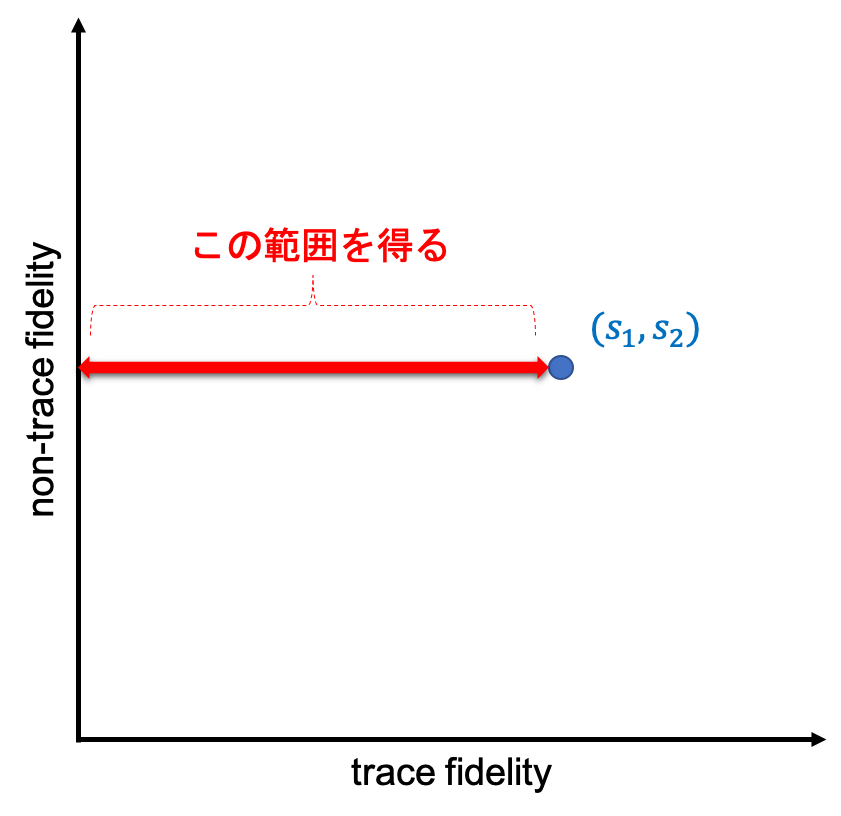

```math
\gdef\middlemid{\;\middle|\;}
\gdef\set#1{\left\{{#1}\right\}}
\gdef\setin#1#2{\left\{{#1} \middlemid {#2}\right\}}
\gdef\sub#1#2{{#1}_{#2}}
```

# Outline
1. Multi-fidelity
2. Multi-fidelity Knowledge Gradient
3. BoTorch実装

# Intro
BoTorch関連記事の3本目です。
- 1本目：[ベイズ最適化ツールBoTorch入門](https://qiita.com/narrowlyapplicable/items/d8e9be53f73d6fa5e4d3)
- 2本目：[[BoTorch]Monte Carlo獲得関数とその最適化](https://qiita.com/narrowlyapplicable/items/3c2c80e05e16fa935cf1)

ベイズ最適化をはじめとしたBlack Box最適化は、評価（＝目的関数値の取得）が容易でない対象での最適化に威力を発揮します。シミュレーションであれば計算コストが高い、実験であれば長時間を要する、といった状況です。代表的な適用先である深層学習のハイパーパラメータ調整も、やはり1回の学習に多大な計算コストを要するexpensiveな例です。  

こうした用途では、最適化にかける計算コストや時間（Budgetと呼びます）を抑えたい場合が多くあります。Budgetを抑えながら最適値を探す際に有効な考え方として、Multi-Fidelity(MF)があります。
本記事では、BoTorchに実装されている[`qMultiFidelityKnowledgeGradient`](https://botorch.org/api/acquisition.html#botorch.acquisition.knowledge_gradient.qMultiFidelityKnowledgeGradient)獲得関数を例に、Multi-fidelityの基礎を解説することを目的とします。

使い方だけを知りたい場合は、[公式のTutorial](https://botorch.org/tutorials/multi_fidelity_bo)を参照することをお勧めします。

# 1. Multi-fidelity

## 1.1. fidelity (忠実度)
多くの実験やシミュレーションにおいて、速度・コストは精度とのトレードオフになります。
-  シミュレーションであれば、精度を犠牲にして高速に計算させる事ができるでしょう。
-  化学実験などにおいても、機材の動作や測定の精度を落として早く結果を得られるものがあります。
-  ベイズ最適化の最もメジャーな適用先である機械学習のハイパーパラメータ調整においても同様です。深層ニューラルネット(DNN)であれば、エポック数や使用するデータ量を落とすことで、その性能を粗く高速に見積もる事ができます。  

このように、評価したい系に **「速度と精度のトレードオフ」を引き起こすパラメータ** があるとき、当該パラメータを ***"fidelity"(忠実度)*** と呼びます。  

一般化のため、表記法を導入しておきます。  
目的関数$f(x), x\in\mathbf{A}$を、fidelityを持つ$g(x, s)$に拡張することを考えます。ここで、fidelityパラメータが1次元であれば、$s\in[0,1]$は1が最高・0が最低（逆なこともあります）すなわち
$$f(x) = g(x, 1), \forall x\in\mathbf{A}$$
となります。  
fidelityパラメータが多次元の場合も、

```math
\begin{align}
&f(x) = g(x, \mathbf{1}_m), \forall x \in \mathbf{A}\\
&\mathbf{s} = (s_1, ..., s_m)\\
&s_i \in [0,1]
\end{align}
```
となります。ただし$\mathbf{1}=(1, 1,..., 1)\in\mathbb{R}^m$です。  

- 例として、DNNのハイパーパラメータ調整を考えてみましょう。
  この場合、精度が目的関数$f$に、ハイパーパラメータが入力$x$に当たります。さらにfidelityパラメータ$s$として、学習データ量を変動させる事にします。  
  本来の学習データ全てを使う場合が$s=1$であり、学習データを半分しか使わない場合を$s=1/2$とします。  
  $f(x)=g(x, 1)$の評価には全データを用いた学習が必要であり、相応の計算時間を要します。これに対し$g(x, 1/2)$の評価では、使うデータ量が半分となるため、より短い計算時間で済む事が期待できます。  
  
  このように、fidelityによって精度と計算コストのトレードオフを調整できる訳です。

$g(x, s)$は$f(x)$のより「安価な」近似、すなわち精度を犠牲に速度・コストを優先した評価といえます。この近似を活用することで、最適値の探索をより少ないコストで実施できる可能性があります。

## 1.2. Multi-fidelity
最適化全体にかかる時間ないしコスト（"Budget"と呼びます）を抑える目的で、fidelityパラメータを変動させる手法をMulti-fidelityと呼びます。  

通常のベイズ最適化では、目的関数$f(x)$の最適値を探すため、
次に評価すべき入力点$x_{new}$を提案 → $f(x_{new})$を評価し結果$y_{new}$を得る → ガウス過程などのモデルを更新  
という作業を繰り返します（outer-loop）。
しかし$f(x_{new})$の評価が重すぎる場合、outer-loop全体に要するBudgetが大きくなりすぎる事があります。そこで評価の一部を低fidelityな$g(x_{new}, s), s<1$で代替することで、outer-loop全体のBudget抑制を狙います。これがMulti-fidelityの基本的考え方です。

[図：outerloop]

具体的には、以下のような変更が加わります。
- ガウス過程回帰モデル（GP）による推定対象を、$f(x)$ではなく$g(x, s)$とする。
  - GPの入力変数は$x$ではなく、fidelityが加わった$(x,s)$となる。
  - GPの目的関数は$g:(x, s)\mapsto\mathbb{R}$となる。
  - 入力$x, x^{'}\in\mathbf{A}$間の内積を定義するカーネルに加えて、fidelityに関するカーネルを定める必要がある。
- 評価コストも、別のGPモデルで推定する。
  - 評価コストは入力とfidelityで定まるものとして推定し、$cost(x, s)$などと表す。

Mulit-fidelityを用いたBOは2017年ごろから登場し、すでに多くの手法が存在します。
代表的なものとしては[FABOLAS](https://proceedings.mlr.press/v54/klein17a.html) (2017)や[Freeze-Thaw](https://arxiv.org/abs/1406.3896)(2014)などがあります。

- FABOLAS論文：[Fast Bayesian Optimization of Machine Learning Hyperparameters on Large Datasets](https://proceedings.mlr.press/v54/klein17a.html)
- Freeze-Thaw論文：[Freeze-Thaw Bayesian Optimization](https://arxiv.org/abs/1406.3896)

しかし本記事では、より後発の手法でBoTorchに採用されているtaKGに対象を絞ります。
taKGは性能面での改善の他に、fidelityをエポック数のような連続的なもの（trace fidelity）と、データ数のような非連続的なものに分けることで、1回の試行から最大限の情報を取得できる利点があります。
また前段階であるcfKGがシンプルで説明しやすいため、Multi-fidelityの入門に向いているという利点もあります。
次章において、まずKnowledge Gradient獲得関数を導入し、そのMulti-fidelity拡張としてcfKG, taKGについて説明します。そして§3において、taKGのBoTorch実装である`qMultiFidelityKnowledgeGradient`を用いた実装について説明します。

# 2. Multi-fidelity Knowledge Gradient

## 2.1. Knowledge Gradient (KG) 獲得関数
Multi-fidelityによるベイズ最適化（MFBO）の詳細に立ち入る前に、Knowledge Gradient（KG）獲得関数について説明しておきます。

- MFBOでは、KGやEntropy Search系など比較的新しい獲得関数を使う傾向があります。
  - 代表的な獲得関数であるEI（Expected Improvement）には、$s<1$では使えないという問題があります。[FrazierのTutorial](https://arxiv.org/abs/1807.02811)にある通り、fidelityを変動させた場合$EI=0$となるため、EIはそのままでは使用困難です。[EIをベースにした手法](https://arc.aiaa.org/doi/abs/10.2514/6.2015-0143)も存在しますが、Entropy Search（ES）やKnowledge Gradient（KG）は自然にMFBOに拡張できるため、これらをベースにした手法が多いようです。
- BoTorchでは、ES系のMES（Max-value Entropy Search）とKGをぞれぞれ拡張したMFBO用獲得関数が実装されています。本記事はKG系に対象を絞ります。


### KGの定義
EIなど従来の獲得関数が各入力点$x_{new}$での事後分布を評価するのに対し、KGは定義域$\mathbf{A}$全体での事後平均に注目します。

ガウス過程にn点のデータ$D_{1:n}$を与えた事後平均を$\mu_n(x)$とし、その下での最適値を

```math
\tau_n:=\min_{x\in\mathbf{A}}{\mu_n(x)}
```

と表します（最小化問題の場合）。  
追加の観測として$D_{n+1:n+q} = (x_{n+1}, y_{n+1}), ..., (x_{n+q}, y_{n+q})$ を得ると、この値は $\tau_{n+q}$ に更新されます。更新によって生じた改善

```math
\tau_n - \tau_{n+q}
```

が、追加観測$D_{n+1:n+q}$から得られる情報量です。
この情報利得の期待値

```math
KG_n(\mathbf{x}) = \mathbb{E}[\tau_n - \tau_{n+q} | (x_{n+1},...,x_{n+q})=\mathbf{x}]
```

を獲得関数とし、値が最大になるように新規観測点 $(x_{n+1},...,x_{n+q})$ を決めることを考えます。この $KG_n(\mathbf{x})$がKnowledge Gradientです。  
  
### KGの計算法
ただし、KGの値は直接計算できません。なぜならば新規評価点における評価 $(y _{n+1}, ..., y _{n+q})$ は不明であり、したがってn+q点を使用した事後平均 $\mu_n(x)$およびその最小値$\tau_{n+q}$は求められないからです。
代わりに現状の事後分布から$y_{n+1}, ..., y_{n+q}$をサンプリングし、その下で事後平均を$\mu_n(x) \rightarrow \mu _{n+q}$に更新します。  

簡単のため$q=1$とすると、新規評価点の候補$x_c$における評価$y_c$を

```math
y_c \sim p(y|x_c, D_{1:n})
```

とサンプリングします。ただし$p(y|x_c, D_{1:n})$はGP事後分布です。
サンプルを1つだけ得た場合、サンプル $y_c$を加えたn+1個のデータ$D_{1:n} \cup \set{(x_c, y_c)\\}$に対してGPを再度フィッティングし、更新された事後平均$\mu_{n+1}$から$\tau_{n+1}$を得ます。

サンプリング個数をMに増やす場合は $\set{y_c^{(i)}}_{i=1}^M$ それぞれについて上記の手順を繰り返し、M通りの$\set{\tau_{n+1}^{(i)}}_{i=1}^M$を計算します。
あとはKGの期待値部分をモンテカルロ近似して

```math
\begin{align}
KG_n(x_c) &= \mathbb{E}[\tau_n - \tau_{n+1} | x_{n+1}=x_c] \\ &\approx \frac{1}{M}\sum_{i=1}^M{\tau_n - \tau_{n+1}^{(i)}}
\end{align}
```

と算出します。

### KGの直感的理解
下記の記事では、KGの定義をグラフを用いて解説しています。図形的に理解したい方（私は苦手ですが……）には特におすすめです。

- [An Illustrated Guide to the Knowledge Gradient Acquisition Function](https://tiao.io/post/an-illustrated-guide-to-the-knowledge-gradient-acquisition-function/)

以下に概要をなぞっておきます。上記記事を読んだ方には不要ですので、次章に進んでください。


出典：[An Illustrated Guide to the Knowledge Gradient Acquisition Function](https://tiao.io/post/an-illustrated-guide-to-the-knowledge-gradient-acquisition-function/)


1. 事後平均の最小値を求める
   ガウス過程にn点のデータ$D_{1:n}$を与えた事後平均$\mu_n(x)$（上図の**赤線**）から、最小値$\tau_n$（上図の**赤い★**）を求めます。
2. 候補点 $x_c$ における評価 $y_c$ をサンプリング
   GP事後分布から$\set{y_c^{(i)}}_i^M$をサンプリングします。上図では1点だけサンプリングしており、**青●**が$y_c^{(1)}$を示しています。
3. 更新後の最小値$\tau_{n+1}$を取得
   データセットに$(x_c, y_c)$を加えてGPのハイパーパラメータを再学習し、更新後の事後平均（上図の**青線**）から最小値$\tau_{n+1}$（上図の**青い★**）を求めます。
4. KGのモンテカルロ近似計算
   2.で得たサンプル$\set{y_c^{(i)}}$の各々について3.を繰り返し、更新後事後平均のサンプル$\set{\mu_{n+1}^{(i)}}$（**下図の緑〜青線**）を得ます。さらに事後平均の最小値サンプル$\set{\tau_{n+1}^{(i)}}$（**下図の破線**）を求め、KGのモンテカルロ近似を得ます。


### KGの特徴
[Frazier et al. 2009](https://www.researchgate.net/publication/220668798_The_Knowledge-Gradient_Policy_for_Correlated_Normal_Beliefs)では、ノイズの多い場合で特に有効とされています。

また下記のブログでは、現状のモデル（事後分布）を信頼し貪欲に探索する傾向があるとされています。
https://sigopt.com/blog/expected-improvement-vs-knowledge-gradient/


## 2.2. cfKG（Continous-Fidelity KG）
KGをMulti-fidelityに拡張します。
cfKG（Continous-Fidelity KG）は、その中でも比較的素直な拡張です。

- cfKG元論文：[Continuous-Fidelity Bayesian Optimization with Knowledge Gradient](https://bayesopt.github.io/papers/2017/20.pdf)

cfKGの基本となる考え方は、*通常のKGを評価コスト（の推定値）で割り、探索の費用対効果を考慮する*というものです。

### 前提となるモデル
MFでは通常の入力 $x$ にfidelity $s$ が加わるため、探索する変数が $(x, s)$ に増えます。つまり定義域$\mathbf{A}$ と fidelityの取りうる範囲 $[0,1]^m$ から、探索空間は $\mathbf{A}\times[0,1]^m$ となります。
この探索空間から出力$y$を推定するGPモデル1と、同探索空間から評価コストを推定する別のGPモデル2、の２種が必要になります。  


またカーネルも$\set{\mathbf{A}\times [0,1]^m}\times\set{\mathbf{A}\times[0,1]^m}\mapsto\mathbb{R}$とする必要があります。

### cfKGの定義
探索空間にfidelityが加わったため、獲得関数で評価すべき候補点は、入力候補点とfidelity候補点の組 $(x_c, s_c)$ となります。

この候補点$(x_c, s_c)$ による情報の利得は、fidelity=1での最小値がどの程度小さくなるか、で定義します。
すなわちfidelity付きGPの事後平均 $\mu_n(x, s)$ に対して

```math
\begin{align}
\tau_n &= \min_{x\in\mathbf{A}}{\mu_n(x, \mathbf{1})} \\
\tau_{n+1}^{(i)} &= \min_{x\in\mathbf{A}}{\mu_{n+1}^{(i)}(x, \mathbf{1})} \\
\end{align}
```

とし、差分 $\tau_n - \tau_{n+1}^{(i)}$ を候補点 $\bigl((x_c, s_c), y_c^{(i)}\bigr)$ による情報利得とします。  

通常の KGであれば情報利得の期待値

```math
KG_n(x,s) \approx \frac{1}{M}\sum_{i=1}^M{\tau_n - \tau_{n+1}^{(i)}}
```

を取りますが、cfKGはこの期待値を**評価コスト$cost_n(x, s)$で割ります**。

```math
\begin{align}
cfKG_n(x_c, s_c) &= \frac{\mathbb{E}[\tau_n - \tau_{n+1} | x_{n+1}=x_c, s_{n+1}=s_c]}{cost_n(x_c,s_c)} \\ &\approx \frac{1}{M}\sum_{i=1}^M{\tau_n - \tau_{n+1}^{(i)}} \quad.
\end{align} 
```

分母の評価コスト $cost_n()$ は、別のGPモデルで推定した値です。

これにより、評価コストと情報利得のトレードオフを考慮した候補点を選ぶことができます。
cfKGが最大となる入力とfidelityの組$(x, s)$を選択し、次の評価対象とします。この$(x, s)$は（推定）評価コスト当たりの情報利得が最も大きくなるため、評価コストを抑えながら効率よく最適化を進められると考えられます。

### Parallel Selectionへの拡張
同時に複数点を選ぶParallel Selectionに拡張をすることを考えます。

通常の入力変数 $x$ とfidelity $s$ の組を $z=(x, s)$と表記します。
同様に$$z_i := (x_i, s_i), \\z^{1:q} := \set{(x_1, s_1), ..., (x_q, s_q)},$$ として、候補点 $z_c^{1:q} = \set{(x_{c1}, s_{c1}), ..., (x_{cq}, s_{cq})}$に対する獲得関数値は

```math
\begin{align}
q\text{-}cfKG(z_c^{1:q}) &= \frac{\mathbb{E}[\tau_n - \tau_{n+1} | z^{1:q}=z_c^{1:q}]}{\max_{1\leq i \leq q}{cost_n(x_{ci}, s_{ci})}} \\

\end{align}
```

分母（評価コスト）は、新規評価点 $z_c^{1:q}$ の最大値としています。これは評価が並列に実行されるとすれば、全体の所要時間は最大値に一致するためです。
分子に大きな変更はなく、評価点が多数の場合のKGです。

### cfKGの問題点
cfKGの大きな弱点として、評価コストが非常に小さくなると分母が0に近づくため、分子＝**情報利得がほぼ０の候補点を選択しやすくなる**性質があります。$s=0$付近に嵌まってしまうと、Budgetの大半をほぼ情報のない探索に費やすこともあります。これはcfKG特有の問題ではなく、FABOLASやESベースの類似手法でも生じる普遍的なものです。
対策としては、分母である評価コストに小さな固定値を足し込む・fidelityが$s\fallingdotseq0$での評価コストに罰則を付ける、といったものがあります。ただし固定値や罰則の付け方などは問題ごとに設定する必要があります。

また、DNNにおけるエポック数のように **「途中経過」があるfidelityの情報を有効活用できない**という問題もあります。
cfKGはfidelityを単一の値と見なしますが、エポック数がNの場合、fidelity $s=N$での評価$g(x, N)$だけでなく、 $s=1,2, ..., N−1$の結果も一括で得ることができます。このN通りの結果を活用するのが、次に紹介するtaKG（trace-aware KG）です。

## 2.3. taKG（trace-aware KG）
### 2.3.1. trace & non-trace fidelity
fidelityを2種類に分け、エポック数のように複数fidelityでの評価を一括で得られるもの（trace fidelity）と、学習データ量のように単一fildelityでの評価しか得られないもの（non-trace fidelity）とを考えます。

例えばエポック数を $s_1$ としたとき、エポック数 $[0, s_1]$ での結果を一括で得ることができます。このようなfidelityパラメータを**trace fidelity**と呼びます。
一方学習データ量を $s_2$ とすると、$s_2$以外での結果は取得できず、別途取得し直す必要があります。このようなfidelityパラメータを**non-trace fidelity**と呼びます。



cfKGでは、trace fidelity $s_1$ の情報を有効に活用できていません。$[0,s_1]$ での評価を一括で得られるにも関わらず、cfKGでは1点$s_1$しか参照しません。
そこで、*trace fidelityとnon-trace fidelityの扱いを分けて、trace fidelityの情報を活用するのがtaKG*です。

同時に観測できるfidelityの組は、$[0, s]$ と $\set{s}$ の形の直積となります。
fidelity $\mathbf{s}=(s_1, s_2)$ について、$s_1$がtrace、$s_2$がnon-trace fidelityであった場合、新規点 $\bigl(x, (s_1, s_2)\bigr)$ を評価することで

$$B(\mathbb{\mathbf{s}}) = [0, s_1] \times \set{s_2}$$

の評価結果を同時に得ることになります。

### 2.3.2. taKG
taKGはcfKGの拡張であり、trace fidelityに対応した修正を加えたものです。

まずtrace fidelityにおける複数の評価結果を扱う表記法を導入します。
１度に観測できるfidelityが1点ではなく、集合を $\mathcal{S}\subset B(\mathbf{s})$ であるとします。
具体的には、次期評価対象を$(x_c, \mathcal{S})$とすれば、$\forall s \in \mathcal{S}$ での目的関数値 $g(x_c, s)$をまとめて取得できます。この結果をまとめて

```math
\mathcal{Y}(x_c, \mathcal{S}) = \set{g(x_c, s) | s \in \mathcal{S}}
```

とします。これは、上図で言えば赤い↔︎の範囲を評価した結果にあたります。

この表記を用いて、cfKGの分子・分母を修正していきます。


### 2.3.3. taKG$^\empty$


### 2.3.4. fidelityのカーネル

# 3. BoTorch実装
BoTorchのMulti-fidelity KG実装は[`qMultiFidelityKnowledgeGradient`](https://botorch.org/api/acquisition.html#botorch.acquisition.knowledge_gradient.qMultiFidelityKnowledgeGradient)です。
その使い方も、[公式のTutorial](https://botorch.org/tutorials/multi_fidelity_bo)に例が示されています。このTutorialを完全に理解できるのであれば、使い方については以下を読む必要はありません。

## 3.1. GPモデル
Tutorialのモデル定義は下記の関数でなされています。

```py :multi_fidelity_bo
def initialize_model(train_x, train_obj):
    # define a surrogate model suited for a "training data"-like fidelity parameter
    # in dimension 6, as in [2]
    model = SingleTaskMultiFidelityGP(
        train_x, 
        train_obj, 
        outcome_transform=Standardize(m=1), ##出力を正規化
        data_fidelity=6                     ##入力の第6次元がnon-trace fidelity.
    )   
    mll = ExactMarginalLogLikelihood(model.likelihood, model)
    return mll, model
```

- GPモデルが通常の`SingleTaskGP`ではなく、[`SingleTaskMultiFidelityGP`](https://botorch.org/api/models.html#botorch.models.gp_regression_fidelity.SingleTaskMultiFidelityGP)になっています。
  - これは通常の`SingleTaskGP`のMulti-fidelity版であり、カーネルが上述のfidelity対応版に拡張されています。
  - `data fidelity`と呼ばれている引数でnon-trace fidelityを指定します。入力Tensorの対応する列番号を引数として与えれば、この列のデータは**non-trace fidelity**として扱われ、ガウス過程においては通常`DownsamplingKernel`への入力となります。
  - この例では使われていないものの、`iteration_fidelity`引数によって**trace fidelity**を指定できます。こちらは通常`ExponentialDecayKernel`が適用されます。
- 内部的には、[`_setup_multifidelity_covar_module`](https://github.com/pytorch/botorch/blob/v0.6.3.1/botorch/models/gp_regression_fidelity.py#L261)でfidelityのカーネル(§2.3.4.参照)を追加しています。
  - 通常の入力に対するカーネルはRBF固定です。ただし引数`linear_truncated`引数をTrueとした場合は、全体に`LinearTruncatedFidelityKernel`が適用され、入力部分は`nu`引数で指定した滑らかさのMaternカーネルに変更となります。
```py :gp_regression_fidelity.py
        kernel = RBFKernel(
            ard_num_dims=len(active_dimsX),
            batch_shape=aug_batch_shape,
            lengthscale_prior=GammaPrior(3.0, 6.0),
            active_dims=active_dimsX,
        )
        additional_kernels = []
        if iteration_fidelity is not None:
            exp_kernel = ExponentialDecayKernel(
                batch_shape=aug_batch_shape,
                lengthscale_prior=GammaPrior(3.0, 6.0),
                offset_prior=GammaPrior(3.0, 6.0),
                power_prior=GammaPrior(3.0, 6.0),
                active_dims=[iteration_fidelity],
            )
            additional_kernels.append(exp_kernel)
        if data_fidelity is not None:
            ds_kernel = DownsamplingKernel(
                batch_shape=aug_batch_shape,
                offset_prior=GammaPrior(3.0, 6.0),
                power_prior=GammaPrior(3.0, 6.0),
                active_dims=[data_fidelity],
            )
            additional_kernels.append(ds_kernel)
        kernel = ProductKernel(kernel, *additional_kernels)
```

## 3.2. 獲得関数
Tutorialで獲得関数の定義部分は以下の通りです。

```py :multi_fidelity_bo
bounds = torch.tensor([[0.0] * problem.dim, [1.0] * problem.dim], **tkwargs)
target_fidelities = {6: 1.0} ## 本来の(最適化対象である)fidelityの列番号と値

cost_model = AffineFidelityCostModel(fidelity_weights={6: 1.0}, fixed_cost=5.0)
cost_aware_utility = InverseCostWeightedUtility(cost_model=cost_model)
## (獲得関数値を)測定コストで割るよう指定

def project(X): ## Design Point を本来のfidelityに移動させる関数
    return project_to_target_fidelity(X=X, target_fidelities=target_fidelities)


def get_mfkg(model):
    
    curr_val_acqf = FixedFeatureAcquisitionFunction(
        acq_function=PosteriorMean(model),
        d=7,
        columns=[6],
        values=[1],
    )
    
    _, current_value = optimize_acqf(
        acq_function=curr_val_acqf,
        bounds=bounds[:,:-1],
        q=1,
        num_restarts=10 if not SMOKE_TEST else 2,
        raw_samples=1024 if not SMOKE_TEST else 4,
        options={"batch_limit": 10, "maxiter": 200},
    )
        
    return qMultiFidelityKnowledgeGradient(
        model=model,
        num_fantasies=128 if not SMOKE_TEST else 2,
        current_value=current_value,
        cost_aware_utility=cost_aware_utility,
        project=project,
    )
```

- １行目：探索範囲を`bounds`として定義
- ２行目：最適化対象となる本来のfidelityについて、列番号(6)と値(1.0)をdictで指定
- ４〜５行目：取得コストのモデルを`AffineFidelityCostModel`で定義
  - f
- `project()`：候補点$(x, s)$を$(x, 1)$に書き換える（だけの）関数。獲得関数定義時に引数として与えます。
- `get_mfkg()`：獲得関数を定義します。
  - まず現状での事後平均$\mu_n(x, s)$ に対して、fidelity=１での最小値

    ```math
    \tau_n = \min_{x\in\mathbf{A}}{\mu_n(x, \mathbf{1})} 
    ```

    を求めます。
    - [`FixedFeatureAcquisitionFunction`](https://botorch.org/api/acquisition.html#botorch.acquisition.fixed_feature.FixedFeatureAcquisitionFunction)は、特定の入力特徴量を固定するために用いるWrapperです。通常、第３引数の特徴量を第４引数の値に固定した状態で、第１引数の獲得関数値を最適化するために用います（第２引数は入力次元数です）。
    - この`FixedFeatureAcquisitionFunction`を用いて、事後平均`PosteriorMean`を最適化する（擬似）獲得関数`curr_val_acqf`を定義します。ここでfidelityのある`columns=[6]`を`values=[1]`に固定し、fidelity=1での最小値するよう設定しています。
    - （擬似）獲得関数`curr_val_acqf`を`optimize_acqf`に与え、$\tau_n$に当たる事後平均最小値`current_value`を求めます。
  - MF獲得関数`qMultiFidelityKnowledgeGradient`を定義し、返します。