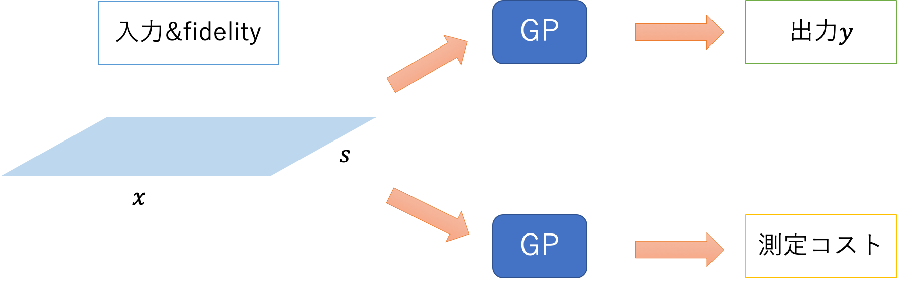

```math
\gdef\middlemid{\;\middle|\;}
\gdef\set#1{\left\{{#1}\right\}}
\gdef\setin#1#2{\left\{{#1} \middlemid {#2}\right\}}
\gdef\sub#1#2{{#1}_{#2}}
```

# Outline
1. Multi-fidelity
2. Multi-fidelity Knowledge Gradient
3. BoTorch実装

# Intro
BoTorch関連記事の3本目です。
- 1本目：[ベイズ最適化ツールBoTorch入門](https://qiita.com/narrowlyapplicable/items/d8e9be53f73d6fa5e4d3)
- 2本目：[[BoTorch]Monte Carlo獲得関数とその最適化](https://qiita.com/narrowlyapplicable/items/3c2c80e05e16fa935cf1)

ベイズ最適化をはじめとしたBlack Box最適化は、評価（＝目的関数値の取得）が容易でない対象での最適化に威力を発揮します。シミュレーションであれば計算コストが高い、実験であれば長時間を要する、といった状況です。代表的な適用先である深層学習のハイパーパラメータ調整も、やはり1回の学習に多大な計算コストを要するexpensiveな例です。  

こうした用途では、最適化にかける計算コストや時間（Budgetと呼びます）を抑えたい場合が多くあります。Budgetを抑えながら最適値を探す際に有効な考え方として、Multi-Fidelity(MF)があります。
本記事では、BoTorchに実装されている`qMultiFidelityKnowledgeGradient`獲得関数を例に、Multi-fidelityの基礎を解説することを目的とします。


# 1. Multi-fidelity

## 1.1. fidelity (忠実度)
多くの実験やシミュレーションにおいて、速度・コストは精度とのトレードオフになります。
-  シミュレーションであれば、精度を犠牲にして高速に計算させる事ができるでしょう。
-  化学実験などにおいても、機材の動作や測定の精度を落として早く結果を得られるものがあります。
-  ベイズ最適化の最もメジャーな適用先である機械学習のハイパーパラメータ調整においても同様です。深層ニューラルネット(DNN)であれば、エポック数や使用するデータ量を落とすことで、その性能を粗く高速に見積もる事ができます。  

このように、評価したい系に **「速度と精度のトレードオフ」を引き起こすパラメータ** があるとき、当該パラメータを ***"fidelity"(忠実度)*** と呼びます。  

一般化のため、表記法を導入しておきます。  
目的関数$f(x), x\in\mathbf{A}$を、fidelityを持つ$g(x, s)$に拡張することを考えます。ここで、fidelityパラメータが1次元であれば、$s\in[0,1]$は1が最高・0が最低（逆なこともあります）すなわち
$$f(x) = g(x, 1), \forall x\in\mathbf{A}$$
となります。  
fidelityパラメータが多次元の場合も、

```math
\begin{align}
&f(x) = g(x, \mathbf{1}_m), \forall x \in \mathbf{A}\\
&\mathbf{s} = (s_1, ..., s_m)\\
&s_i \in [0,1]
\end{align}
```
となります。ただし$\mathbf{1}=(1, 1,..., 1)\in\mathbb{R}^m$です。  

- 例として、DNNのハイパーパラメータ調整を考えてみましょう。
  この場合、精度が目的関数$f$に、ハイパーパラメータが入力$x$に当たります。さらにfidelityパラメータ$s$として、学習データ量を変動させる事にします。  
  本来の学習データ全てを使う場合が$s=1$であり、学習データを半分しか使わない場合を$s=1/2$とします。  
  $f(x)=g(x, 1)$の評価には全データを用いた学習が必要であり、相応の計算時間を要します。これに対し$g(x, 1/2)$の評価では、使うデータ量が半分となるため、より短い計算時間で済む事が期待できます。  
  
  このように、fidelityによって精度と計算コストのトレードオフを調整できる訳です。

$g(x, s)$は$f(x)$のより「安価な」近似、すなわち精度を犠牲に速度・コストを優先した評価といえます。この近似を活用することで、最適値の探索をより少ないコストで実施できる可能性があります。

## 1.2. Multi-fidelity
最適化全体にかかる時間ないしコスト（"Budget"と呼びます）を抑える目的で、fidelityパラメータを変動させる手法をMulti-fidelityと呼びます。  

通常のベイズ最適化では、目的関数$f(x)$の最適値を探すため、
次に評価すべき入力点$x_{new}$を提案 → $f(x_{new})$を評価し結果$y_{new}$を得る → ガウス過程などのモデルを更新  
という作業を繰り返します（outer-loop）。
しかし$f(x_{new})$の評価が重すぎる場合、outer-loop全体に要するBudgetが大きくなりすぎる事があります。そこで評価の一部を低fidelityな$g(x_{new}, s), s<1$で代替することで、outer-loop全体のBudget抑制を狙います。これがMulti-fidelityの基本的考え方です。

[図：outerloop]

具体的には、以下のような変更が加わります。
- ガウス過程回帰モデル（GP）による推定対象を、$f(x)$ではなく$g(x, s)$とする。
  - GPの入力変数は$x$ではなく、fidelityが加わった$(x,s)$となる。
  - GPの目的関数は$g:(x, s)\mapsto\mathbb{R}$となる。
  - 入力$x, x^{'}\in\mathbf{A}$間の内積を定義するカーネルに加えて、fidelityに関するカーネルを定める必要がある。
- 評価コストも、別のGPモデルで推定する。
  - 評価コストは入力とfidelityで定まるものとして推定し、$cost(x, s)$などと表す。

Mulit-fidelityを用いたBOは2017年ごろから登場し、すでに多くの手法が存在します。
代表的なものとしては[FABOLAS](https://proceedings.mlr.press/v54/klein17a.html) (2017)や[Freeze-Thaw](https://arxiv.org/abs/1406.3896)(2014)などがあります。

- FABOLAS論文：[Fast Bayesian Optimization of Machine Learning Hyperparameters on Large Datasets](https://proceedings.mlr.press/v54/klein17a.html)
- Freeze-Thaw論文：[Freeze-Thaw Bayesian Optimization](https://arxiv.org/abs/1406.3896)

しかし本記事では、より後発の手法でBoTorchに採用されているtaKGに対象を絞ります。
taKGは性能面での改善の他に、fidelityをエポック数のような連続的なもの（trace fidelity）と、データ数のような非連続的なものに分けることで、1回の試行から最大限の情報を取得できる利点があります。
また前段階であるcfKGがシンプルで説明しやすいため、Multi-fidelityの入門に向いているという利点もあります。
次章において、まずKnowledge Gradient獲得関数を導入し、そのMulti-fidelity拡張としてcfKG, taKGについて説明します。そして§3において、taKGのBoTorch実装である`qMultiFidelityKnowledgeGradient`を用いた実装について説明します。

# 2. Multi-fidelity Knowledge Gradient

## 2.1. Knowledge Gradient (KG) 獲得関数
Multi-fidelityによるベイズ最適化（MFBO）の詳細に立ち入る前に、Knowledge Gradient（KG）獲得関数について説明しておきます。

- MFBOでは、KGやEntropy Search系など比較的新しい獲得関数を使う傾向があります。
  - 代表的な獲得関数であるEI（Expected Improvement）には、$s<1$では使えないという問題があります。[FrazierのTutorial](https://arxiv.org/abs/1807.02811)にある通り、fidelityを変動させた場合$EI=0$となるため、EIはそのままでは使用困難です。[EIをベースにした手法](https://arc.aiaa.org/doi/abs/10.2514/6.2015-0143)も存在しますが、Entropy Search（ES）やKnowledge Gradient（KG）は自然にMFBOに拡張できるため、これらをベースにした手法が多いようです。
- BoTorchでは、ES系のMES（Max-value Entropy Search）とKGをぞれぞれ拡張したMFBO用獲得関数が実装されています。本記事はKG系に対象を絞ります。


### KGの定義
EIなど従来の獲得関数が各入力点$x_{new}$での事後分布を評価するのに対し、KGは定義域$\mathbf{A}$全体での事後平均に注目します。

ガウス過程にn点のデータ$D_{1:n}$を与えた事後平均を$\mu_n(x)$とし、その下での最適値を

```math
\tau_n:=\min_{x\in\mathbf{A}}{\mu_n(x)}
```

と表します（最小化問題の場合）。  
追加の観測として$D_{n+1:n+q} = (x_{n+1}, y_{n+1}), ..., (x_{n+q}, y_{n+q})$ を得ると、この値は $\tau_{n+q}$ に更新されます。更新によって生じた改善

```math
\tau_n - \tau_{n+q}
```

が、追加観測$D_{n+1:n+q}$から得られる情報量です。
この情報量の期待値

```math
KG_n(\mathbf{x}) = \mathbb{E}[\tau_n - \tau_{n+q} | (x_{n+1},...,x_{n+q})=\mathbf{x}]
```

を獲得関数とし、値が最大になるように新規観測点 $(x_{n+1},...,x_{n+q})$ を決めることを考えます。この $KG_n(\mathbf{x})$がKnowledge Gradientです。  
  
### KGの計算法
ただし、KGの値は直接計算できません。なぜならば新規評価点における評価 $(y _{n+1}, ..., y _{n+q})$ は不明であり、したがってn+q点を使用した事後平均 $\mu_n(x)$およびその最小値$\tau_{n+q}$は求められないからです。
代わりに現状の事後分布から$y_{n+1}, ..., y_{n+q}$をサンプリングし、その下で事後平均を$\mu_n(x) \rightarrow \mu _{n+q}$に更新します。  

簡単のため$q=1$とすると、新規評価点の候補$x_c$における評価$y_c$を

```math
y_c \sim p(y|x_c, D_{1:n})
```

とサンプリングします。ただし$p(y|x_c, D_{1:n})$はGP事後分布です。
サンプルを1つだけ得た場合、サンプル $y_c$を加えたn+1個のデータ$D_{1:n} \cup \set{(x_c, y_c)\\}$に対してGPを再度フィッティングし、更新された事後平均$\mu_{n+1}$から$\tau_{n+1}$を得ます。

サンプリング個数をMに増やす場合は $\set{y_c^{(i)}}_{i=1}^M$ それぞれについて上記の手順を繰り返し、M通りの$\set{\tau_{n+1}^{(i)}}_{i=1}^M$を計算します。
あとはKGの期待値部分をモンテカルロ近似して

```math
\begin{align}
KG_n(x) &= \mathbb{E}[\tau_n - \tau_{n+q} | (x_{n+1},...,x_{n+q})=\mathbf{x}] \\ &\approx \frac{1}{M}\sum_{i=1}^M{\tau_n - \tau_{n+1}^{(i)}}
\end{align}
```

### KGの直感的理解
下記サイトでは、KGの定義をグラフを用いて解説しています。図形的に理解したい方（私は苦手ですが……）には特におすすめです。

- [An Illustrated Guide to the Knowledge Gradient Acquisition Function](https://tiao.io/post/an-illustrated-guide-to-the-knowledge-gradient-acquisition-function/)

下記に概要をなぞっておきます。このサイトを読んだ方には不要ですので、次章に進んでください。

1. 事後平均の最小値を求める
   ガウス過程にn点のデータ$D_{1:n}$を与えた事後平均$\mu_n(x)$（図の**赤線**）から、最小値
2. d


出典：[An Illustrated Guide to the Knowledge Gradient Acquisition Function](https://tiao.io/post/an-illustrated-guide-to-the-knowledge-gradient-acquisition-function/)

### KGの特徴
[Frazier et al. 2009](https://www.researchgate.net/publication/220668798_The_Knowledge-Gradient_Policy_for_Correlated_Normal_Beliefs)では、ノイズの多い場合で特に有効とされています。

また下記のブログでは、現状のモデル（事後分布）を信頼し貪欲に探索する傾向があるとされています。
https://sigopt.com/blog/expected-improvement-vs-knowledge-gradient/


## 2.2. cfKG
KGをMulti-fidelityに拡張します。
cfKG（Continous-Fidelity KG）は、その中でも比較的素直な拡張です。

- cfKG元論文：[Continuous-Fidelity Bayesian Optimization with Knowledge Gradient](https://bayesopt.github.io/papers/2017/20.pdf)

### cfKGの定義
cfKGの基本は、通常の獲得関数値（ここではKG）を評価コスト（の推定値）で割り、探索の費用対効果を考慮するというものです。

MFでは通常の入力 $x$ にfidelity $s$ が加わるため、探索する変数が $(x, s)$ に増えます。つまり定義域$\mathbf{A}$ と fidelityの取りうる範囲 $[0,1]^m$ から、探索空間は $\mathbf{A}\times[0,1]^m$ となります。
この探索空間から出力$y$を推定するGPモデル1と、同探索空間から評価コストを推定する別のGPモデル2、の２種が必要になります。  



## 2.3. taKG

# 3. BoTorch実装

- 獲得関数：qMFKG
- GPモデルも、Multi-fidelity専用のモデルを用いる必要がある。これは入力と別にfidelityについてもカーネルを作る必要があるため。
  - [SingleTaskMultiFidelityGP](https://botorch.org/api/models.html#botorch.models.gp_regression_fidelity.SingleTaskMultiFidelityGP)：通常の`SingleTaskGP`のMulti-fidelity版
  - `_setup_multifidelity_covar_module`でfidelityのカーネルを追加している。