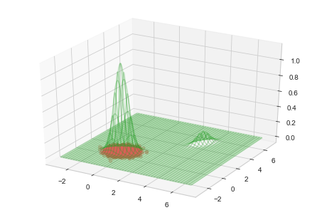

# [PyMC]多峰事後分布のためのsample_smc (Sequential Monte Carlo Sampler)

# Intro
この記事では、ベイズ推定用ライブラリ[PyMC](https://www.pymc.io/welcome.html)にあるMCMC実装の一種、[`sample_smc`](https://www.pymc.io/projects/docs/en/latest/api/generated/pymc.smc.sample_smc.html)について扱います。

MCMCによるベイズ推論は、多峰な事後分布形状に弱いという弱点があります。
単純な例として、やや離れた正規分布×2からMCMCでサンプリングしてみましょう。下図は、MCMCのデファクトスタンダードであるNUTS (No U-Turn Sampler) による結果です。

左側の正規分布から移動できず、右側の正規分布からはサンプリングできていないことがわかります。これは、2つのmode（事後確率の高い領域）の間に谷があり、MCMCサンプラーがこの谷を乗り越えられないことに起因します。
古典的な統計の範疇では、こうした多峰な事後分布に遭遇する機会は稀でした。しかしベイズ統計モデリングは柔軟性が高く、複雑なモデルでもベイズ信頼区間・予測区間を得て、統計的な意思決定が可能です。そのため扱う事後分布も複雑さを増しており、多峰事後分布による問題は避けては通れないものになりつつあります。

この問題に対処する代表的な方法として、レプリカ交換法があります。

- [RStanによる実装例 (StatModeling Memorandum)](https://statmodeling.hatenablog.com/entry/stan-parallel-tempering)
- [BDA3](https://www.amazon.co.jp/dp/1439840954/)・[渡辺ベイズ本](https://www.amazon.co.jp/dp/4339024627/)・[計算統計Ⅱ](https://www.amazon.co.jp/dp/B078WSTYC7/)などにも説明あり

しかしレプリカ交換法を使おうとすると、実用上の困難がいくつかあります。以下は私見ですが、

- 複数のchain（独立したMCMC試行）を並列実行して、そのうち1つのchainだけが結果となるため、効率が良くない。
- パラメータ（後述する逆温度の配置間隔）が難しく、問題ごとに手動で調整する必要がある。
  - 逆温度の配置間隔が開き過ぎていると、多峰分布の峰(mode)間の移動に失敗しやすい。実用上は真の事後分布形状が未知であることが多いため、うまく調整することは困難になりがち。
  - 配置感覚の経験則が知られているが、実際にはうまく行かないことが多い。
- 主要ライブラリには実装がなく、自力で実装する必要がある。
  - tensorflow probabilityには実装がありますが、NUTSが使えないためステップ幅を決め打ちする必要がある等、使い勝手はあまりよくない。

レプリカ交換を代替し得る手法として、パーティクルフィルタに用いる逐次モンテカルロ (Sequential Monte Carlo) 法を応用した手法が使われ始めています。
この手法の名前（と手法の細部）は分野によって微妙に異なるようですが、ここではPyMCに実装されている`sample_smc`に注目し、名前もこれに倣ってSMCと呼ぶことにします。

#　ベイズ推論における逆温度パラメータ

# 粒子フィルタとSequential Monte Carlo

- 参考図書に樋口本を挙げておくと良い

# SMC sampler

- pymc公式ドキュメントでは参考文献を２件挙げられているが、応用寄りで
- likelihood temperingと呼ぶ向きもあり、[化学分野で応用例](https://www.sciencedirect.com/science/article/abs/pii/S0263876221003634)がある。
  - 別々に複数分野で発明されているのかも?
  - 参照を辿っていくと[ウプサラ大学の資料](https://www.it.uu.se/research/systems_and_control/education/2017/smc/schedule/lecture16_handout.pdf)に行き着く。ここでも"likelihood tempering"と呼ばれている。
    - 「Sequential Monte Carloを使ったlikelihood temperingという手法」「それらの総称が（スライドの表題でもある）SMC Sampler」とも読めるので、本記事ではそのように呼ぶことにした。

# 実行例

# 参考（になりそうな）文献
- 逆温度について
  - [『ベイズ統計の理論と方法』](https://www.amazon.co.jp/dp/4339024627/)
  - [『計算統計Ⅱ』](https://www.amazon.co.jp/dp/B078WSTYC7/)
- 粒子フィルタについて
  - 『予測にいかす統計モデリングの基本』
  - "Bayesian Filetering and Smoothing"
- SMC samplerについて
  - ["Sequential Monte Carlo methods : Lecture 16 - SMC samplers"](https://www.it.uu.se/research/systems_and_control/education/2017/smc/schedule/lecture16_handout.pdf)