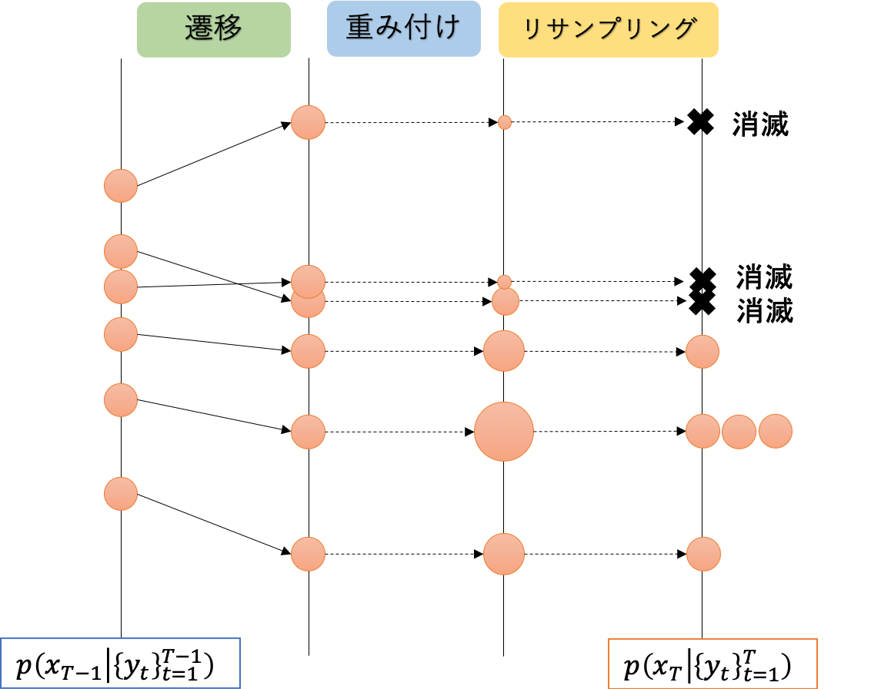

# [PyMC]多峰事後分布のためのsample_smc (Sequential Monte Carlo Sampler)

# Intro
この記事では、ベイズ推定用ライブラリ[PyMC](https://www.pymc.io/welcome.html)にあるMCMC実装の一種、[`sample_smc`](https://www.pymc.io/projects/docs/en/latest/api/generated/pymc.smc.sample_smc.html)について扱います。

MCMCによるベイズ推論は、多峰な事後分布形状に弱いという弱点があります。
単純な例として、やや離れた正規分布×2からMCMCでサンプリングしてみましょう。下図は、MCMCのデファクトスタンダードであるNUTS (No U-Turn Sampler) による結果です。

左側の正規分布から移動できず、右側の正規分布からはサンプリングできていないことがわかります。これは、2つのmode（事後確率の高い領域）の間に谷があり、MCMCサンプラーがこの谷を乗り越えられないことに起因します。

この問題に対処する代表的な方法として、レプリカ交換法があります。

- [RStanによる実装例 (StatModeling Memorandum)](https://statmodeling.hatenablog.com/entry/stan-parallel-tempering)
- [BDA3](https://www.amazon.co.jp/dp/1439840954/)・[渡辺ベイズ本](https://www.amazon.co.jp/dp/4339024627/)・[計算統計Ⅱ](https://www.amazon.co.jp/dp/B078WSTYC7/)などにも説明あり

しかしレプリカ交換法を使おうとすると、実用上の困難がいくつかあります。

- 複数のchain（独立したMCMC試行）を並列実行して、そのうち1つのchainだけが結果となるため、効率が良くない。
- パラメータ（後述する逆温度の配置間隔）が難しく、問題ごとに手動で調整する必要がある。
  - 逆温度の配置間隔が開き過ぎていると、多峰分布の峰(mode)間の移動に失敗しやすい。実用上は真の事後分布形状が未知であることが多いため、うまく調整することは困難になりがち。
  - 配置感覚の経験則が知られているが、実際にはうまく行かないことが多い。
- 主要ライブラリには実装がなく、自力で実装する必要がある。
  - tensorflow probabilityには実装があるものの、ステップ幅などMCMCのパラメータを手動で設定する必要があり、使い勝手はあまりよくない。~~あとそもそもtf-pもう使ってない。~~

レプリカ交換を代替し得る手法として、パーティクルフィルタに用いる逐次モンテカルロ (Sequential Monte Carlo) 法を応用した手法が使われ始めています。
この手法の名前（と手法の細部）は分野によって微妙に異なるようですが、ここではPyMCに実装されている`sample_smc`に注目し、名前もこれに倣ってSMC Smaplerと呼ぶことにします。

#　1. ベイズ推論における逆温度パラメータ

## 1.1. 逆温度の導入
まず、通常のベイズ推論をおさらいしておきます。
データ $X^{(n)}=\{x_n\}_{n=1}^N$ にモデル $p(x|\theta)$ を仮定し、そのパラメータ $\theta$ に事前分布 $p(\theta)$ を仮定したとき、パラメータ $\theta$ の事後分布は

```math
p(\theta | X^{(n)}) := \frac{p(\theta) \prod_{n=1}^N p(x_n|\theta)}{Z_n(X^{(n)})}
```

となります。右辺分母の$Z_n(X^{(n)})$は、確率の総和が1になるようにする正規化定数です。

ここで事後分布をより一般に拡張し、逆温度$\beta$の事後分布

```math
p^{\beta}(\theta | X^{(n)}) := \frac{p(\theta) \prod_{n=1}^N p(x_n|\theta)^{\beta}}{Z_n(X^{(n)})}
```

を導入します。通常の事後分布との違いは、**尤度が$\beta$乗されている**という1点だけです。

直感的には、逆温度$\beta$は尤度と事前分布のバランスを制御するパラメータと言えます。
事後確率最大化法（MAP推定）を行う場合、事前分布は正規化に相当しますから、逆温度は正規化の強さを制御するパラメータとみなすことができます。
この解釈については、[カイヤンさんのブログ記事](https://chijan.hatenablog.jp/archive/2018/11/02)で詳しく紹介されていますので、ピンと来ない場合はこちらを参照してください。

## 1.2. 逆温度によるMCMCの改善

### 1.2.1. 事後分布形状への影響

事前分布が一様、あるいは極めて弱い弱情報事前分布であった場合を考えてみます。
その場合、事前分布による正規化の効果は殆どあるいは全くありませんから、逆温度$\beta$は尤度（そして事後分布）の形状を直接的に変動させるパラメータと見做せることになります。

[図：βによる尤度の変化]

図はβを1から小さくしていった例を示しています。
$0<\beta<1$ の範囲で $\beta$ を小さくしていけば、尤度は平坦になっていきます。事前分布がほぼ平坦であれば、事後分布も同様です。

この性質を利用して、MCMCを改善することができます。
Introで述べた通り、MCMCは多峰分布からのサンプリングを苦手としています。そこで逆温度を$0<\beta<1$ に設定し、事後分布を平坦にすれば、この問題はある程度緩和できます。極論$\beta=0$ としてしまえば、尤度は完全に定数になり、サンプリングも容易になります。

ただし最終的に求めたいのは $\beta=1$ での事後分布ですから、逆温度を小さくするだけでは不足です。逆温度をMCMCと並行して変更したり、複数の逆温度設定でMCMCを並行させたりといった操作が必要になります。こうした逆温度の操作によって、多峰分布による問題を解決する方法が複数存在しています。

### 1.2.2. 焼きなまし

単純な方法としては、 $\beta=0$ でのサンプリングから初めて、徐々に $\beta \to 1$ と大きくしていく方法が考えられます。
いわゆるバーンイン（初期値付近から抜け出すまで、初期のサンプリング結果を捨てる期間）において $\beta$ を動かし、その後は $\beta=1$ に固定すれば、本来の事後分布からサンプリングできます。バーンイン期間で $0<\beta<1$ とすることで、初期値付近のmodeから脱出する効果が期待できます。
これは最適化における焼きなましと同じ考え方です。

この方法は、初期値付近の比較的小さなmodeを脱出する程度であれば、十分に機能することがほとんどです。ただしIntroに示したような多峰事後分布では、両方のmodeからサンプリングすることはできません。
逆温度を単調増加させるため、一度 $\beta=1$ としてしまえば、あとは通常のMCMCと変わらないことによります。したがって、バーンイン以降のサンプリングでは、多峰性に対処することは望めません。

### 1.2.3. レプリカ交換モンテカルロ法

多峰分布からのサンプリングを実現する方法は複数提案されていますが、その中でも代表的な手法がレプリカ交換法（Replica Exchange もしくは Parallel Tempering）です。

焼きなましのように単一のMCMCサンプラー上で逆温度を操作するのではなく、複数のMCMCサンプラーを走らせ、それぞれに異なる逆温度を設定します。

[逆温度交換の概念図]

図の通り、徐々に逆温度が小さく（高温）になるように配置し、隣接するサンプラーと定期的に位置を「交換」します。
直感的には、高温側（$\beta$ が小さい状態）のサンプラーでmode間の大規模遷移を行い、その遷移が「交換」によって $\beta=1$ のサンプラーに伝えられている、と言えます。

[直感的な遷移図]


# 2. 粒子フィルタ

Sequential Monte Carlo（以下SMC）は、時系列モデルとくに非線形・非正規な状態空間モデルの学習のために考案された、MCMCの一種です。粒子フィルタ（パーティクルフィルタ）とも呼ばれます。

SMCの詳細は、下記の書籍を参照してください。本章は概要のみを記載します。

- [樋口知之『予測にいかす 統計モデリングの基礎 改訂第2版』](https://www.kspub.co.jp/book/detail/5285701.html) 
  

また、状態空間モデルや粒子フィルタについて既知の場合は読み飛ばしてください。

## 2.1. 状態空間モデルの推定

時系列データ $\{y_t\}_{t=1}^T$ があり、状態空間モデル

```math
\begin{align}
&y_0  \ \ \ \quad y_1 &y_T\\
&↑ \qquad ↑  &↑ \\
&x_0 \rightarrow x_1 \to \  ... \ \to &x_T
\end{align}
```

に従っているとします。これは

- 観測できない内部状態 $x_t$ が何らかのモデル（内部状態モデル）に従って $x_{t+1}$ に遷移し
- そこに観測ノイズが乗った $y_t$が観測される

とするモデルです。
内部状態モデルは、ランダム性を表すノイズ項$ v_t$と、決定論的な遷移関数$f$を用いて
$$x_{t+1} = f(x_t, v_t)$$
と表現することが一般的です。
これに観測ノイズ$\epsilon_t$が加わって、観測値
$$y_t = x_t + \epsilon_t$$
となります。

状態空間モデルを用いた時系列解析では、直接観測できない内部状態 $ \{x_t\}_t^T$ を推定する・未来の$\{x_t\}_{t>T}, \{y_t\}_{t>T}$を予測することを考えます。
状態空間モデルが線形正規であれば、推定・予測はカルマンフィルタで実行できます。カルマンフィルタは非線形な場合にも拡張でき、拡張カルマンフィルタ（EKF）・無香カルマンフィルタ（UKF）などのアルゴリズムが存在します。しかし非線形性が強い場合などには適応しきれないため、モンテカルロ近似を用いた粒子フィルタを用います。

## 2.2. 粒子フィルタ

粒子フィルタ（パーティクルフィルタ）は、観測 $\{y_t\}_{t=1}^T$ から内部状態の分布 $p(x_t | \{y_t\}_{t=1}^T)$を推定するアルゴリズムです。
その概要を下図に表しています。



1. 時刻 $t-1$における事後分布 $p(x_{T-1} | \{y_t\}_{t=1}^T)$ をモンテカルロ近似したサンプル
   $$x_{T-1}^{(i)} \sim p(x_{T-1} | \{y_t\}_{t=1}^T)$$
   がある。
2. $\{x_{T-1}^{(i)}\}$を状態区間モデル（の内部状態モデル）に従って遷移させ、新しいサンプルを生成する。
   内部状態モデルのノイズ$ v_{T-1}$は乱数で生成する。
   $$x_T^{(i)} = f(x_{T-1}^{(i)}, v_{T-1}^{(i)})$$
3. 時刻Tでの観測値 $y_T$を取得し、その尤度 $p(y_T | x_T^{(i)})$から、サンプル $x_T^{(i)}$の重み $w_T^{(i)}$を計算する。
   $$w_T^{(i)} := \frac{p(y_T | x_T^{(i)})}{\sum_i{p(y_T | x_T^{(i)})}}$$
4. 各サンプルを重みに従って再サンプリングする。
   すなわち、確率 $\frac{w_T^{(i)}}{\sum_i{w_T^{(i)}}}$で $x_T^{(i)}$をサンプリングし、所定回数くり返した結果を$p(x_{T-1} | \{y_t\}_{t=1}^T)$のモンテカルロ近似とする。
5. $T-1 \leftarrow T$として、2.に戻る。

このアルゴリズムはベイズ推論を逐次的に実行しています。実際に

- （1.では）時刻$1\sim T-1$までの観測値から求めた時刻$T-1$での内部状態の事後分布があり
- （2.で）時刻$T$の内部状態$x_T$の予測サンプルを生成し
- （3.と4.で）時刻$T$の観測$y_T$を取得したのち、予測分布を修正する

という手順を踏んでいます。
予測分布の修正については、

# 3. SMC sampler

- pymc公式ドキュメントでは参考文献を２件挙げているが、応用寄りで
- likelihood temperingと呼ぶ向きもあり、[化学分野で応用例](https://www.sciencedirect.com/science/article/abs/pii/S0263876221003634)がある。
  - 別々に複数分野で発明されているのかも?
  - 参照を辿っていくと[ウプサラ大学の資料](https://www.it.uu.se/research/systems_and_control/education/2017/smc/schedule/lecture16_handout.pdf)に行き着く。ここでも"likelihood tempering"と呼ばれている。
    - 「Sequential Monte Carloを使ったlikelihood temperingという手法」「それらの総称が（スライドの表題でもある）SMC Sampler」とも読めるので、本記事ではそのように呼ぶことにした。

# 実行例

# 参考（になりそうな）文献
- 逆温度について
  - [『ベイズ統計の理論と方法』](https://www.amazon.co.jp/dp/4339024627/)
  - [『計算統計Ⅱ』](https://www.amazon.co.jp/dp/B078WSTYC7/)
- 粒子フィルタについて
  - 『予測にいかす統計モデリングの基本』
  - "Bayesian Filetering and Smoothing"
- SMC samplerについて
  - ["Sequential Monte Carlo methods : Lecture 16 - SMC samplers"](https://www.it.uu.se/research/systems_and_control/education/2017/smc/schedule/lecture16_handout.pdf)